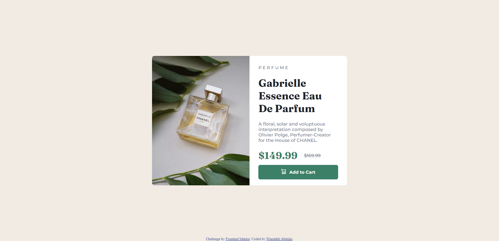

# Frontend Mentor - Product preview card component solution

This is a solution to the [Product preview card component challenge on Frontend Mentor](https://www.frontendmentor.io/challenges/product-preview-card-component-GO7UmttRfa). Frontend Mentor challenges help you improve your coding skills by building realistic projects. 

## Table of contents

- [Overview](#overview)
  - [The challenge](#the-challenge)
  - [Screenshot](#screenshot)
  - [Links](#links)
- [My process](#my-process)
  - [Built with](#built-with)
  - [What I learned](#what-i-learned)
  - [Continued development](#continued-development)
  - [Useful resources](#useful-resources)
- [Author](#author)
- [Acknowledgments](#acknowledgments)

**Note: Delete this note and update the table of contents based on what sections you keep.**

## Overview

### The challenge

Users should be able to:

- View the optimal layout depending on their device's screen size
- See hover and focus states for interactive elements

### Screenshot

### Links

- Solution URL: (https://github.com/wundaab/product-preview-card-component-main.git)
- Live Site URL: (https://sage-boba-1e2ee9.netlify.app/)

### Built with

- Flexbox

### Continued development

Using flexbox to organize box-like content and for responsiveness.

### Useful resources

- [W3schools](https://www.w3schools.com/) - This helped me in remembering syntax. It's really useful and it's my go-to site.

## Author

- Frontend Mentor - [@wundaab](https://www.frontendmentor.io/profile/yourusername)

